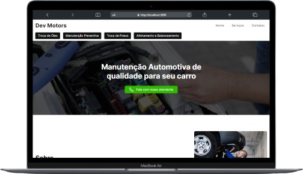

## DevMotors

Este é um projeto layout de um site de manutenção de automóveis utilizando o [Next.js](https://nextjs.org/).

&nbsp;
## 👨🏻‍💻 Começando...

Primeiro, execute os seguintes comandos no cmd:

```bash
npm install
```
```bash
npm run dev
```

Digite no seu navegador a URL `http://localhost:3000` para ver o projeto.

&nbsp;
## 💻/📱 Layouts do projeto

O projeto contem responsividade em todas as páginas.

&nbsp;
- Home page

| Home | Serviços e contatos |
|---|---|
|  |  |

&nbsp;
- Home page mobile
  
| Home | Menu | Serviços | Contatos |
|---|---|---|---|
|  |   |   |  |

&nbsp;
- Página de serviços
  
|  Desktop | Mobile |
|---|---|
|  |  |
 
