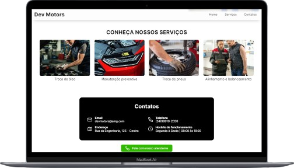
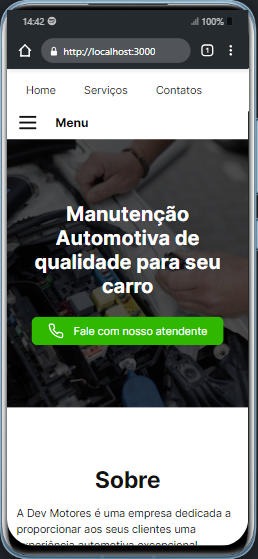
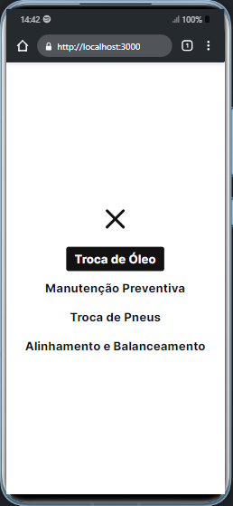
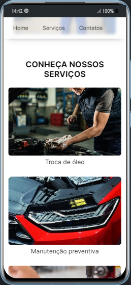
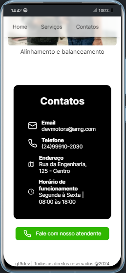
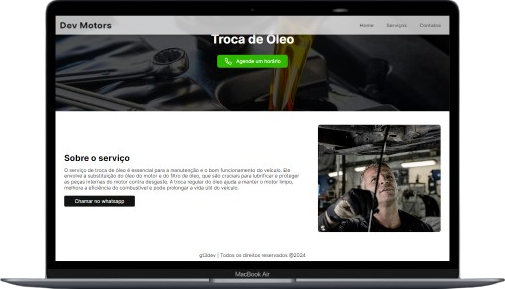

## DevMotors

Este é um projeto layout de um site de manutenção de automóveis utilizando o [Next.js](https://nextjs.org/).

## 👨🏻‍💻 Começando...

Primeiro, execute os seguintes comandos no cmd:

```bash
npm install
# em seguida
npm run dev
```

Abra [http://localhost:3000](http://localhost:3000) com seu navegador para ver o projeto.

---

## 💻/📱 Layouts do projeto

O projeto contem responsividade em todas as páginas.

| Home page (Home, serviços e contatos) |
|--|--|
| 
| |

##
- Home page mobile

| Home page mobile |
|--|--|--|--|
|
| 
| 
| |

##
| Página de serviço (Troca de óleo) |
|--|--|
|
| |
 